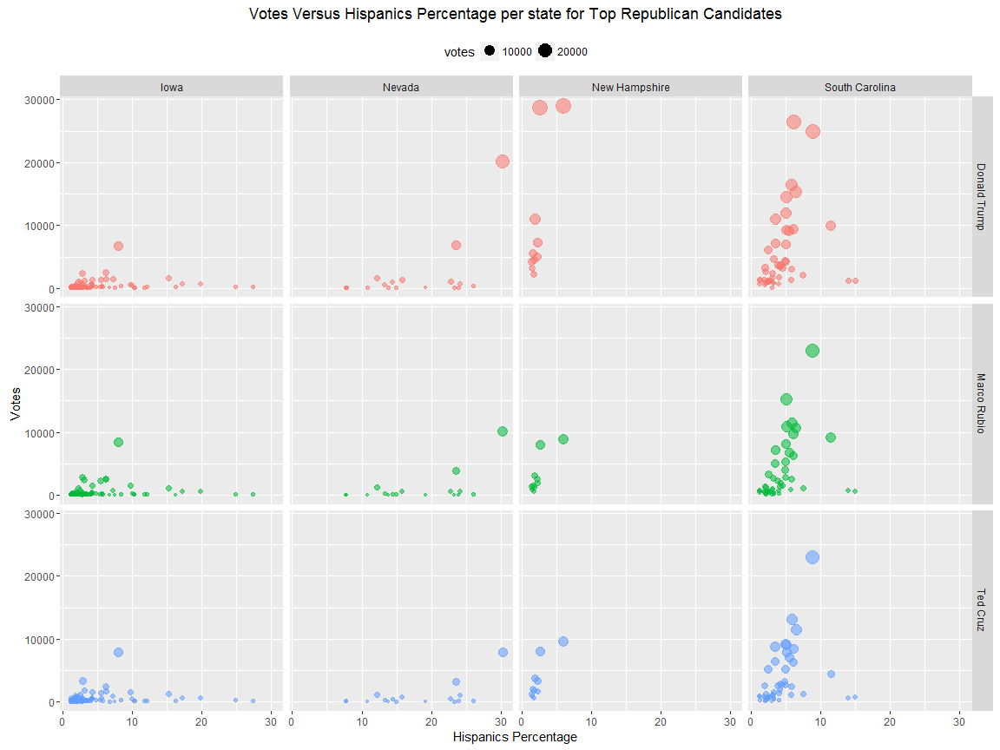
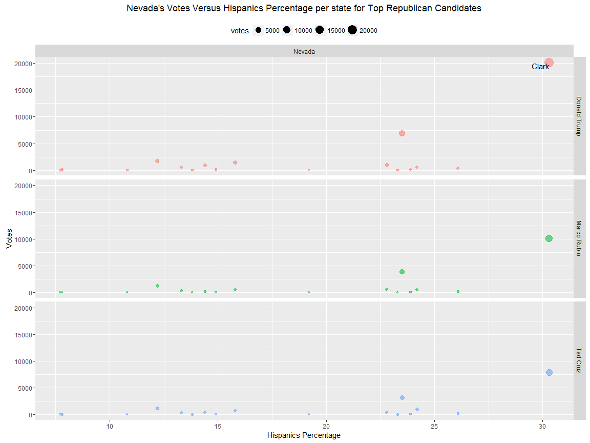
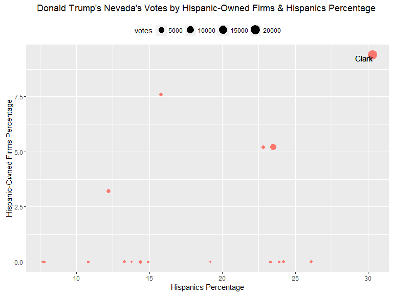

# US Elections 2016: Nevada results and Trump's Claims about Hispanic Support
OmaymaS  
March 15, 2016  
 
###Overview


This work focuses on the results of the US elections' primaries in Nevada. The Republican candidate Donald Trump highlighted that his victory with 46% in Nevada was supported by Hispanics/Lationos. There were different political analysis about what nevada showed about Trump's Hispanic support and what it did not. 

The analysis starts with a look into the top-three Republican candidates' results in the four given states, then it zooms in to look into Nevada, and finally digs deeper into the results of an interesting county in Nevada that gave extreme values.

The following questions are addressed:

* Can we find a correlation between the percentage of hispanics in Nevada's counties and the number of votes given to Donald Trump? Can we see other trends in the rest of the states?

* Is there something special that we can spot about the counties that gave Trump the highest votes in Nevada?

* What about the trends with the other Republican candidates?


###Pre-Processing


```r
#calling libraries
library(dplyr)
library(ggplot2)
library(knitr)
```

###Data Processing


```r
#reading data

res<-read.csv("../primary_results.csv",header = T, stringsAsFactors = F) #read primary results

county_facts<-read.csv("../county_facts.csv",header = T, stringsAsFactors = F) #read county facts
```

-In the county facts sheet the name of the counties contains the word County; e.g *"Autauga County"* which is not the case in the result's sheet. To be able to join both dataframes, we'll remove the word County from the county_facts column (area_name).


```r
#remove "County" from the county name in the county fact sheet
county_facts$area_name<-gsub(" County","",county_facts$area_name)

#select some columns from the county fact sheet
facts <-county_facts %>%
        filter(state_abbreviation %in% unique(res$state_abbreviation)) %>%
        select(state_abbreviation=state_abbreviation,county=area_name, populaion2014=PST045214,
               populatuionpersqm=POP060210,white=RHI825214,hispanic=RHI725214,asian=RHI425214,black=RHI225214,
               firms=SBO001207,firms.black=SBO315207,firms.natives=SBO115207,firms.asians=SBO215207,
               firms.pacific=SBO515207,firms.hispanic=SBO415207,firms.women=SBO015207)
               
#merge res and facts dataframes based on the county and state abbreviation columns
primdata<-inner_join(res,facts,by = c("state_abbreviation","county"))

#select top republican candidates
primdata_rep<-filter(primdata,candidate %in% c("Ted Cruz","Donald Trump","Marco Rubio"))
```

###Data Analysis


#### -Votes Vs. Hispanics' percentage for top-3 Republican candidates in the given states

-First of all, we'll look if any correlations can be seen between hispanics' percentage in counties and the number of votes. The following plot shows that for the top-three republican candidates including Donald Trump.


```r
ggplot(data=primdata_rep, aes(x=hispanic,y=votes))+
        geom_point(aes(color=candidate,size=votes, alpha=0.4))+ 
        facet_grid(candidate~state)+
        labs(title="Votes Versus Hispanics Percentage per state for Top Republican Candidates")+
        scale_x_continuous(name="Hispanics Percentage")+
        scale_y_continuous(name="Votes")+
        theme(legend.position="top")+
        guides(color=FALSE,alpha = FALSE)
```

\

From the first glance, we cannot see significant correlations. However, We can see that:

* Most of the counties in New Hampshire and South Carolina have low percentage of Hispanics (<10%) in the first place.

* The counties in Lowa with high percentage of Hispanics gave low votes to the three candidates.

* Nevada, in which Donald Trump won, has a county with the highest percentage of Hispanics which also gave him the higest votes

So we'll have a closer look on Nevada. 


#### -Votes Vs. Hispanics' percentage for top-3 Republican candidates in Nevada


```r
primdata_rep_Nevada<-filter(primdata_rep,state=="Nevada")

ggplot(data=primdata_rep_Nevada , aes(x=hispanic,y=votes))+
        geom_point(aes(color=candidate,size=votes, alpha=0.4))+ 
        facet_grid(candidate~state)+
        labs(title="Nevada's Votes Versus Hispanics Percentage per state for Top Republican Candidates")+
        scale_x_continuous(name="Hispanics Percentage")+
        scale_y_continuous(name="Votes")+
        theme(legend.position="top")+
        guides(color=FALSE,alpha = FALSE)+
        geom_text(data=filter(primdata_rep_Nevada,votes>20000)  ,aes(label=county),hjust=1, vjust=1)
```

\

As we can see, one main county in Nevada, "Clark", stands out in the data and it is obviously the one which was the reason for Trump's victory in Nevada. We need to dig deeper and see if there is something special about it. So we'll extract some columns and calculate the following values:

* votes_percandidate: the percentage of each Republican candidate's total votes coming from each county.

* votes_total: The total final percentage of Nevada's votes for each Republican candidate.

* votes_perstate: the percentage of Nevada's votes going to each Republican candidate in each county.


```r
Data_Nevada<- primdata %>% 
        ungroup() %>%  
        filter(state=="Nevada" & party=="Republican") %>% 
        mutate (votes_perstate=100*votes/sum(votes)) %>%
        group_by(candidate) %>%
        mutate(votes_percandidate=100*votes/sum(votes) , votes_total=sum(votes_perstate)) %>%
        select(state, county,populaion2014,
        candidate,votes,fraction_votes,votes_percandidate,votes_total,votes_perstate)
```


#### A closer look into Clark County in Nevada

If we have a closer look at Clark we can see the following:

* Clark is the highest populated county in Nevada and  most of the votes came from it which is clear with all the candidates.

* Trump won Nevada by **46%** and **58%** of the total votes he received, came from Clark (i.e. 26% of Nevada's total votes)


|state  |county | populaion2014|candidate    | votes| fraction_votes| votes_percandidate| votes_total| votes_perstate|
|:------|:------|-------------:|:------------|-----:|--------------:|------------------:|-----------:|--------------:|
|Nevada |Clark  |       2069681|Donald Trump | 20132|          0.489|           58.30124|   46.116349|      26.886402|
|Nevada |Clark  |       2069681|Marco Rubio  | 10114|          0.246|           56.37681|   23.958973|      13.507305|
|Nevada |Clark  |       2069681|Ted Cruz     |  7857|          0.191|           48.86498|   21.473597|      10.493069|
|Nevada |Clark  |       2069681|Ben Carson   |  1488|          0.036|           41.11633|    4.833195|       1.987233|
|Nevada |Clark  |       2069681|John Kasich  |  1399|          0.034|           51.64267|    3.617885|       1.868373|

Based on the given data, it is worth checking whether there are other factors *(especially if related to Hispanics)* that might be contributing to the high percentage of votes coming from Clark in specific. One hypothesis is money and business play a big role in political life!

**So what about investigating the percentage of hispanic firms in Clark, could they have a role in influencing voting?**


#### -Hispanic-owned firms investigated

By plotting the Trump's votes in Nevada  and looking at the percentage of both hispanics and hispanic-owned firms in Nevada, we can see that:

* Clark is on the top  right of the grid, i.e. it has high percentage of hespanics, as mentioned earlier, and also the highest percentage of hispanic-owned firms in all the given counties(9.4%).


```r
max(primdata$firms.hispanic)
```

```
## [1] 9.4
```

```r
primdata$county[which.max(primdata$firms.hispanic)]
```

```
## [1] "Clark"
```


```r
ggplot(data= filter(primdata_rep_Nevada, candidate=="Donald Trump") , aes(x=hispanic,y=firms.hispanic))+
        geom_point(aes(color=candidate,size=votes))+ 
        # facet_grid(candidate~state)+
        labs(title="Donald Trump's Nevada's Votes by Hispanic-Owned Firms & Hispanics Percentage ")+
        scale_x_continuous(name="Hispanics Percentage")+
        scale_y_continuous(name="Hispanic-Owned Firms Percentage")+
        theme(legend.position="top")+
        guides(color=FALSE,alpha = FALSE)+
        geom_text(data=filter(primdata_rep_Nevada,votes>7000)  ,aes(label=county),hjust=1, vjust=1)
```

\


### Conclusion

This analysis focused on the victory of Trump on Nevada, trying to find out if his claims about Hispanic support could be linked to any specific factors or if any trends could be found. 

According to the given data and plots we can conclude the following:

* There is no specific trend to relate the percentage of Hispanics to votes in a certain state/county.

* There is one county, Clark, in Nevada that has the highest population and  most of the votes come from it. Consequently, it affected the final candidates' results significantly.

* If we look at the number of votes versus the percentage of hispanics, we should not just look at a boxplot or the mean and make conclusions. Because  one outlier or an extreme value, as in the case of Clark, creates a bias in the mean and consequntly leads to inaccurate conclusions.

* Since Clark County has the highest percentage of Hispanics, the hishest percentage of Hispanic-owned firms and the highest number of votes given to Trump in Nevada. It is worth investigating whether the Hispanic businesses had an influence. We cannot confidently give an answer based on the available data. But it is something to highlight and investigate further whenever further data is available from other locations.

* If we have access to further data about the percentage of Hispanics who support Republicans in Nevada in General and Clark in specific, the number of Hispanic participants in the primary, the nature of the Hispanic-owned firms, we might be able to gain more insights into the results in Nevada.
